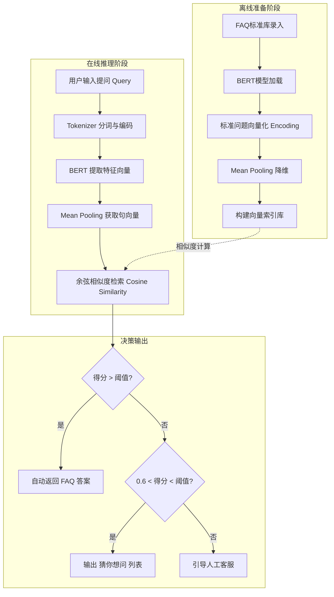

### 作业 2：基于 BERT 的智能客服 FAQ 匹配技术方案

#### 一、 技术方案概述

本方案旨在利用 BERT（Bidirectional Encoder Representations from Transformers）强大的语义理解能力，将传统的关键词匹配升级为深度语义匹配。通过将 FAQ 库中的标准问题和用户的实时提问转化为高维向量，利用向量空间中的距离来衡量语义相似度，从而实现精准的自动问答。

#### 二、 核心技术流程

1.  **模型选型与初始化**：
    *   选用预训练的 `bert-base-chinese` 模型。
    *   **文本编码（Encoding）**：利用 BERT 的 Transformer 编码器结构。文本进入模型后，经过 Embedding 层及 12 层注意力机制处理，提取每个 Token 的特征。
    *   **池化处理（Pooling）**：为了获得整句话的向量表示，不直接使用 `[CLS]` 位，而是推荐使用 **Mean Pooling（均值池化）**。即对 BERT 输出的 `last_hidden_state` 在序列长度维度取平均值，得到一个 768 维的固定长度向量。

2.  **离线索引阶段（针对 FAQ 库）**：
    *   对 FAQ 管理系统中的所有“标准提问”和“相似提问”进行预处理。
    *   调用 BERT 模型生成对应的语义向量。
    *   将向量连同对应的 Answer ID 存入向量数据库（如 FAISS 或 Elasticsearch 向量插件）。

3.  **在线匹配阶段（针对用户提问）**：
    *   **向量化**：用户输入 Query，通过同样的 BERT 模型和 Mean Pooling 策略实时生成 768 维向量。
    *   **相似度计算**：采用 **余弦相似度（Cosine Similarity）** 计算用户提问向量与库中所有标准问题向量的夹角余弦值，得分区间为 [-1, 1]。
    *   **结果筛选**：设定置信度阈值（如 0.85）。若最高分得分大于阈值，则直接返回对应的 FAQ 回答；若得分在 0.6-0.85 之间，可作为“猜你想问”推荐；若低于 0.6，则转人工客服。

---

#### 三、 业务逻辑流程图

---

#### 四、 方案优势

*   **解决语义孤岛**：能够识别“怎么收费”与“价格是多少”这类字面不同但语义相同的提问。
*   **高效检索**：通过向量数据库索引，即使 FAQ 库规模达到万级以上，也能在毫秒级内完成匹配。
*   **低维护成本**：减少了对繁琐同义词表和正则规则的依赖。
